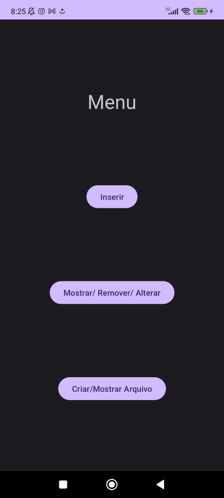
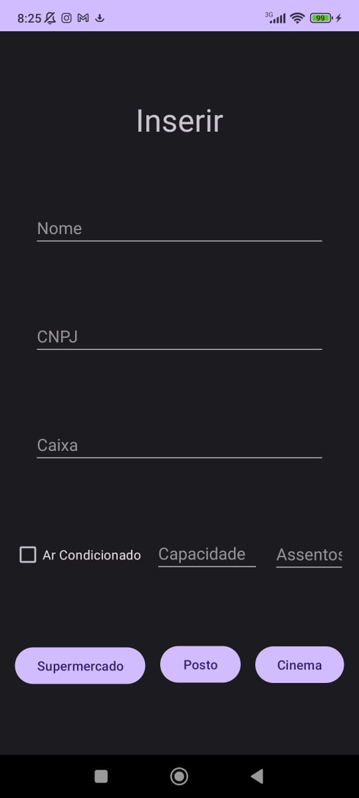
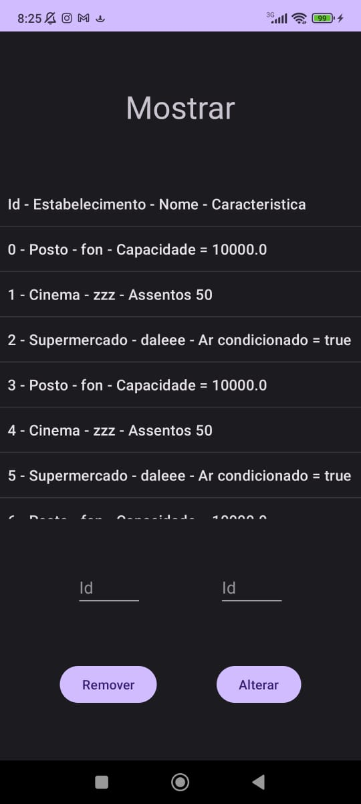
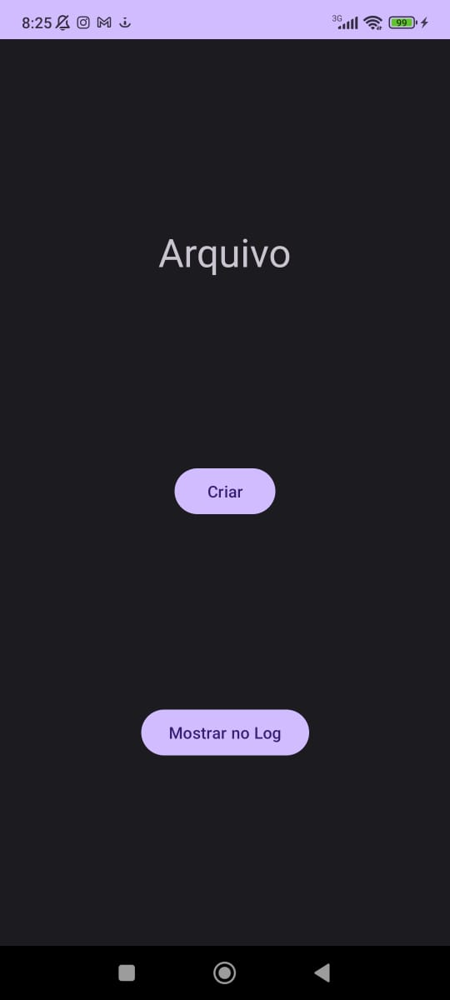
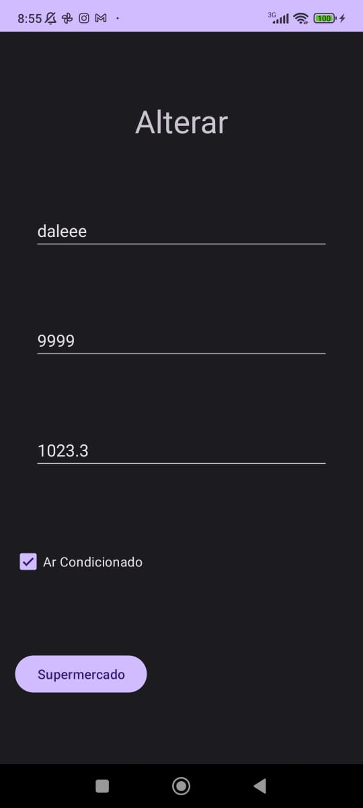

<h1 align="center">Prova1-PDM-Kotlin</h1>

## 📖 About the project
This project primarily focused on the back-end and mobile programming logic, with the aim of improving the flow of data between screens, handling of classes and inheritance, and file creation in Kotlin.

|  |  |  |  |  |
|:---:|:---:|:---:|:---:|:---:|
| **Menu** | **Insert** | **Show** | **Archive** | **Alter** |

## 🦾 Technologies used
<div style="display: flex;">
 


</div>

## 🤔 What i learned
- I gained a deeper understanding of back-end and mobile programming logic.
- I enhanced my proficiency in managing data flow between different screens.
- I honed my skills in working with classes and inheritance.
- I mastered the art of file creation in Kotlin.

## 🧑‍🎓 Authors
- <a href="https://github.com/DevGustavus"> Gustavo Machado Pontes - DevGustavus </a>
- <a href="https://github.com/c-Alvinn"> Álvaro Ríquel Dias - c-Alvinn </a>

## 👽 How to clone this project

````bash
    # Select where you want to clone
    $ cd ~/Documents
````

````bash
    # Clone the project
    $ git clone https://github.com/DevGustavus/form_login_cadastro.git
````

````bash
    # Check if cloning worked fine
    $ cd ~/Documents/form_login_cadastro
    $ ls
````
